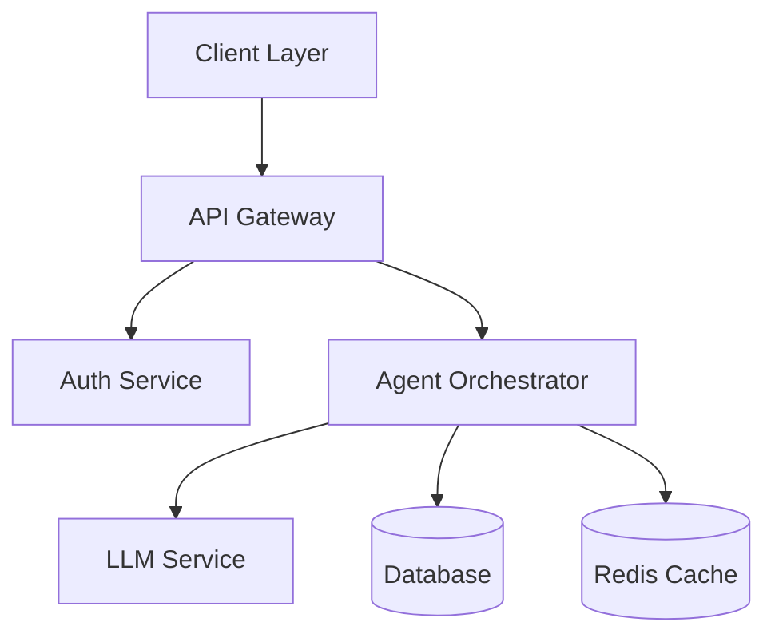

# Agentic OS

A state-of-the-art AI agent operating system with multi-model orchestration capabilities.

## System Architecture



## Features

- 🤖 Multi-model AI Agent Support
- 🔄 Real-time Streaming Responses
- 🔒 Enterprise-grade Security
- 📊 Advanced Analytics
- 🎨 Modern UI/UX
- 🚀 High Performance
- 📱 Responsive Design

## Tech Stack

### Frontend
- Next.js 14 (App Router)
- TypeScript
- Tailwind CSS
- WebSocket
- Redux Toolkit

### Backend
- Node.js/Express
- PostgreSQL
- Redis
- WebSocket
- JWT Authentication

### DevOps
- Docker
- GitHub Actions
- Kubernetes
- Prometheus/Grafana

## Getting Started

1. Clone the repository:
```bash
git clone https://github.com/seanmcrae/Agentic-OS.git
cd Agentic-OS
```

2. Install dependencies:
```bash
npm install
```

3. Set up environment variables:
```bash
cp .env.example .env
```

4. Start development server:
```bash
npm run dev
```

## Project Structure

```
Agentic-OS/
├── apps/
│   ├── web/                 # Frontend application
│   └── api/                 # Backend API
├── packages/
│   ├── ui/                  # Shared UI components
│   ├── core/                # Core business logic
│   └── config/             # Shared configuration
├── infrastructure/         # Infrastructure as code
├── scripts/               # Development scripts
└── docs/                  # Documentation
```

## Contributing

Please read our [Contributing Guide](CONTRIBUTING.md) before making a pull request.

## License

MIT